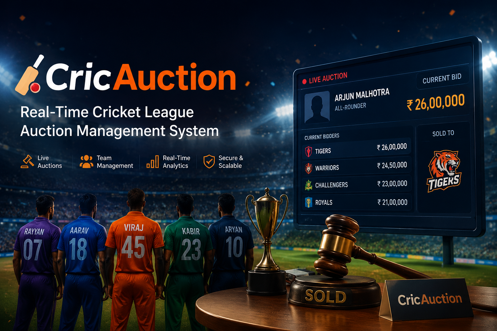

<div align="center">

<h1>🏏 CricAuction</h1>
<h3>Real-Time Cricket League Auction Management System</h3>



</div>

## 📋 Table of Contents

- [Project Overview](#project-overview)
- [Core Features](#core-features)
- [Technology Stack](#technology-stack)
- [Architecture & Repository Structure](#architecture--repository-structure)
- [Getting Started](#getting-started)
- [Development Workflow](#development-workflow)
- [Real-Time Architecture](#real-time-architecture)
- [Project Status](#project-status)
- [Contributing](#contributing)
- [Documentation](#documentation)

---

## 🎯 Project Overview

**CricAuction** is an enterprise-grade SaaS platform designed to streamline the entire lifecycle of cricket league management—from organizer onboarding through live automated player auctions. It provides tournament organizers with an intuitive administrative workspace and spectators/teams with real-time bidding capabilities powered by WebSocket technology.

### Vision

To democratize professional cricket league management by providing a transparent, fast, and automated bidding platform that handles complex auction workflows in real-time, with sub-200ms latency guarantees and atomic transaction handling.

### Key Use Cases

- **Tournament Organizers:** Create leagues, configure team budgets, manage player registrations, and orchestrate live auctions
- **Teams:** Submit bids in real-time, track squad composition, and manage budget allocations  
- **Players:** Self-register with profile information and participate in transparent, live bidding events

---

## ✨ Core Features

### 1. **Organizer Authentication & Workspace**
- Secure JWT-based login/registration with email validation
- Profile management with avatar uploads (JPG, PNG, GIF; max 2MB)
- Organization/company context tracking
- Multi-language support via global selector

### 2. **Tournament Management Hub**
- Create tournaments with configurable parameters:
  - Number of teams, budget per team, max players per team
  - Venue information and auction scheduling
- Dashboard with live telemetry metrics:
  - Total tournaments, active tournaments, upcoming events
  - Recent tournament activity log
- Tournament list view with search, filtering, and pagination
- Tournament lifecycle tracking (5-step progress footer)

### 3. **Player Registration & Management**
- **Public Self-Registration:** External-facing form for player profile intake
  - Personal info: name, age, mobile, city, email, photo upload
  - Cricket profile: role selection (Batsman, Bowler, All Rounder, Wicket Keeper)
  - Bowling attributes: style, arm type
- **Global Player Directory:** Searchable, filterable roster with edit/delete controls
- Role-based pill badges and status tracking

### 4. **Team Configuration & Roster Management**
- Team franchise cards with emblem assets and budget tracking
- Squad roster tables with player details:
  - Player name, role, purchase price, status
- Team detail views with owner information
- Real-time budget remaining calculations

### 5. **Live Auction Control Room**
The centerpiece of CricAuction—a real-time bidding workspace featuring:

#### Current Player Display
- Player profile image, name, role, cricket attributes (batting/bowling style, nationality)
- Base price and starting bid visualization

#### Real-Time Bid Metrics
- Current bid display (updates dynamically)
- Highest bidder with franchise emblem/logo
- Quick increment buttons: +₹1K, +₹2K, +₹5K, +₹10K, +₹20K, +₹50K
- Custom bid entry field with validation

#### Team Proxy Grid
- All participating franchise emblems for manual bid selection
- Rapid switching between teams without page reload

#### Bid Ledger & Activity Feed
- Latest 5 bids sidebar (franchise name, bid amount, timestamp)
- Live auction timeline log with color-coded transaction nodes
- Sequential activity tracking

#### Administrative Controls
- **Mark Sold:** Freeze bidding, finalize transaction, log winner
- **Mark Unsold:** Invalidate lot, reset for re-auction
- **Next Player:** Advance to next auction lot

#### Sold Confirmation Modal
- Player image with "SOLD" stamp overlay
- Winning franchise details and final bid amount
- Auto-advance countdown timer (configurable, typically 4 seconds)

### 6. **Player Randomization & Reveal**
- Randomizer carousel modal with mystery cards
- Server-side shuffle logic (client cannot manipulate)
- Secure reveal animation before bidding commences
- System integrity validation messaging

---

## 🛠 Technology Stack

| Layer | Technology | Notes |
|-------|-----------|-------|
| **Frontend** | React 18+ (Vite) | JavaScript only—no TypeScript |
| **State Management** | React Context API | Zustand available if complexity grows |
| **Backend** | Node.js 18+ + Express | RESTful API design |
| **Database** | MongoDB (Mongoose ODM) | Can use local instance or MongoDB Atlas |
| **Real-Time Communication** | Socket.IO | WebSocket-based event broadcasting |
| **Authentication** | JWT (JSON Web Tokens) | 7-day default expiration, refresh rotation |
| **Styling** | CSS (Vanilla) | BEM naming convention recommended |
| **Package Management** | npm | Monorepo structure with workspaces |
| **Linting** | ESLint | Config provided; adhere to rules |
| **CI/CD** | GitHub Actions | `.github/workflows/ci.yml` defines pipeline |

### Language Composition
- **JavaScript:** 77.5%
- **CSS:** 20.7%
- **PowerShell:** 1.2%
- **HTML:** 0.6%

---

## 📁 Architecture & Repository Structure

This is a **monorepo** with frontend and backend as sibling directories under the project root.

```
PROJECT-AUCTION/
├── .github/
│   └── workflows/
│       └── ci.yml                              ← CI/CD pipeline (lint, test, build)
│
├── Auction-Project/                            ← FRONTEND (React + Vite)
│   ├── public/
│   │   └── assets/                             ← Static images, logos, emblems
│   ├── src/
│   │   ├── components/
│   │   │   ├── common/                         ← Shared UI: Button, Modal, SearchBar, Avatar, Pill, etc.
│   │   │   ├── layout/                         ← Sidebar, TopBar, ProgressFooter
│   │   │   ├── dashboard/                      ← MetricCard, TournamentRow
│   │   │   ├── tournament/                     ← TournamentCard, TournamentForm
│   │   │   ├── teams/                          ← TeamCard, RosterTable
│   │   │   ├── players/                        ← PlayerRow, PlayerForm
│   │   │   └── auction/                        ← BidLedger, ActivityFeed, BidControls, etc.
│   │   ├── pages/
│   │   │   ├── auth/                           ← LoginPage, RegisterPage
│   │   │   ├── profile/                        ← ProfilePage
│   │   │   ├── dashboard/                      ← DashboardPage
│   │   │   ├── tournaments/                    ← List, Create, Hub (tabbed)
│   │   │   ├── registration/                   ← PublicRegistrationPage
│   │   │   ├── teams/                          ← TeamDetailPage
│   │   │   └── auction/                        ← LiveAuctionPage
│   │   ├── hooks/
│   │   │   ├── useAuth.js                      ← Auth state & token management
│   │   │   ├── useSocket.js                    ← Socket.IO connection
│   │   │   └── useTournament.js                ← Tournament data fetching
│   │   ├── context/
│   │   │   ├── AuthContext.jsx                 ← Logged-in user state
│   │   │   └── AuctionContext.jsx              ← Live auction state
│   │   ├── services/
│   │   │   ├── api.js                          ← Axios instance + auth headers
│   │   │   ├── authService.js                  ← login, register, getProfile
│   │   │   ├── tournamentService.js            ← Tournament CRUD
│   │   │   ├── playerService.js                ← Player CRUD
│   │   │   ├── teamService.js                  ← Team fetch + roster
│   │   │   └── auctionService.js               ← Auction state + bid history
│   │   ├── utils/
│   │   │   ├── formatCurrency.js               ← Indian numbering: ₹1,00,000
│   │   │   ├── formatDate.js
│   │   │   └── validators.js                   ← Form validation helpers
│   │   ├── constants/
│   │   │   ├── roles.js                        ← Role enums (Batsman, Bowler, etc.)
│   │   │   └── socketEvents.js                 ← Socket event names (TBD)
│   │   ├── router/
│   │   │   └── AppRouter.jsx                   ← React Router + auth guards
│   │   ├── App.jsx
│   │   ├── index.css
│   │   └── main.jsx
│   ├── .env.example
│   ├── vite.config.js
│   └── package.json
│
├── Auction-Server/                             ← BACKEND (Node.js + Express)
│   ├── src/
│   │   ├── config/
│   │   │   └── db.js                           ← MongoDB connection
│   │   ├── models/
│   │   │   ├── User.js                         ← Organizer account schema
│   │   │   ├── Tournament.js                   ← Tournament entity
│   │   │   ├── Player.js                       ← Registered player
│   │   │   ├── Team.js                         ← Franchise + budget
│   │   │   └── Bid.js                          ← Bid transaction record
│   │   ├── routes/
│   │   │   ├── auth.routes.js                  ← POST /auth/login, /register
│   │   │   ├── tournament.routes.js            ← CRUD /tournaments
│   │   │   ├── player.routes.js                ← CRUD /players
│   │   │   ├── team.routes.js                  ← GET /teams, /teams/:id
│   │   │   └── auction.routes.js               ← Auction endpoints
│   │   ├── controllers/
│   │   │   ├── auth.controller.js
│   │   │   ├── tournament.controller.js
│   │   │   ├── player.controller.js
│   │   │   ├── team.controller.js
│   │   │   └── auction.controller.js
│   │   ├── middleware/
│   │   │   ├── auth.middleware.js              ← JWT verification guard
│   │   │   └── errorHandler.js                 ← Centralized error formatting
│   │   ├── socket/
│   │   │   ├── auctionSocket.js                ← Socket.IO event handlers
│   │   │   └── socketManager.js                ← Server init + room management
│   │   └── utils/
│   │       └── bidValidator.js                 ← Atomic bid validation
│   ├── .env.example
│   ├── server.js                               ← Express + Socket.IO entry point
│   └── package.json
│
├── Agent.md                                    ← Engineering guide for contributors
├── PRD.md                                      ← Complete product specification
├── README.md                                   ← You are here
├── package.json                                ← Root monorepo wrapper
└── package-lock.json
```

---

## 🚀 Getting Started

### Prerequisites

- **Node.js:** 18+ (lock version in `.nvmrc`)
- **npm:** 9+
- **MongoDB:** Running locally or provide MongoDB Atlas URI

### Installation

```bash
# Clone the repository
git clone <repo-url>
cd Project-auction

# Install root dependencies (if monorepo scripts are defined)
npm install

# Frontend Setup
cd Auction-Project
npm install

# Backend Setup (once Auction-Server/ folder is scaffolded)
cd ../Auction-Server
npm install
```

### Environment Variables

Create `.env` files in both frontend and backend directories:

#### Frontend (`Auction-Project/.env`)
```env
VITE_API_URL=http://localhost:5000/api
VITE_SOCKET_URL=http://localhost:5000
```

#### Backend (`Auction-Server/.env`)
```env
PORT=5000
MONGO_URI=mongodb://localhost:27017/cricauction
JWT_SECRET=your_secret_key_here
JWT_EXPIRES_IN=7d
CLIENT_URL=http://localhost:5173
NODE_ENV=development
```

### Running the Application

```bash
# Terminal 1: Frontend (from Auction-Project/)
npm run dev                    # Runs on http://localhost:5173

# Terminal 2: Backend (from Auction-Server/)
npm run dev                    # Runs on http://localhost:5000

# Ensure MongoDB is running
mongod                         # Or use Atlas connection string
```

---

## 💻 Development Workflow

### Code Organization Principles

1. **Component Files:** PascalCase (e.g., `TeamCard.jsx`, `Button.jsx`)
2. **Utility/Service Files:** camelCase (e.g., `formatCurrency.js`, `authService.js`)
3. **API Calls:** Always use `services/` layer—never inline `fetch` or `axios` in components
4. **Currency:** Always format INR with Indian numbering (₹1,00,000) using `utils/formatCurrency.js`
5. **Constants:** Use `constants/roles.js` for role enums; avoid hardcoded strings
6. **Auth Guards:** Implement in `router/AppRouter.jsx`, not in individual pages
7. **Socket Events:** Define in `constants/socketEvents.js` to avoid typos across client/server

### Folder Responsibilities

| Folder | Responsibility |
|--------|-----------------|
| `components/` | Reusable UI blocks (not page-specific) |
| `pages/` | Route-level screens (one file per route) |
| `services/` | API wrapper functions (axios) |
| `hooks/` | Custom React hooks (auth, socket, data fetching) |
| `context/` | Global state providers (Auth, Auction) |
| `utils/` | Pure helper functions (formatting, validation) |
| `constants/` | Enums, event names, role definitions |

### Linting & Code Quality

```bash
npm run lint                   # Run ESLint
npm run lint:fix              # Auto-fix lint issues
npm run build                 # Production build (also runs linting)
```

---

## ⚡ Real-Time Architecture

### Performance Guarantees

- **Bid Latency:** < 200ms from submission to broadcast across all clients
- **UI Updates:** Smooth real-time transitions without page reloads
- **Concurrent Bids:** Server-side atomic validation using arrival timestamps

### WebSocket Event Flow

1. **Player Reveal:** Server shuffles player pool → broadcasts `PLAYER_REVEALED` event
2. **Bid Submission:** Client submits bid → backend validates atomically → broadcasts `BID_PLACED` to all tournament room subscribers
3. **Mark Sold:** Admin clicks "Mark Sold" → backend finalizes transaction → broadcasts `PLAYER_SOLD` + team roster updates
4. **Next Player:** Admin clicks "Next Player" → triggers new randomizer → `SHUFFLE_START` event

### Socket.IO Room Architecture

- Each tournament gets its own Socket.IO room: `tournament_${tournamentId}`
- Organizers and team members join their tournament's room
- Events broadcast only to subscribers in that room (no cross-tournament bleeding)

### Atomic Bid Validation

```
Incoming Bid
    ↓
Check: Bid >= Current Bid + Minimum Increment (₹1,000)
    ↓
Check: Bid <= Team's Remaining Budget
    ↓
Check: No conflicting bid already recorded at same/higher timestamp
    ↓
[Accept] Update ledger, broadcast to room, or [Reject] return error
```

---

## 📊 Project Status

### Current Build State

Refer to the **[Changelog in Agent.md](./Agent.md#11-changelog--update-log)** for the latest session updates.

**Frontend Screens:**
- ⬜ Login & Register Pages — Not Started
- ⬜ Profile & Settings — Not Started
- ⬜ Dashboard — Not Started
- ⬜ Tournament Management (Create, List, Hub) — Not Started
- ⬜ Registration & Teams — Not Started
- ⬜ Auction Workspace — Not Started

**Infrastructure:**
- ✅ Frontend Scaffold (Vite + React) — Initialized
- ⬜ Routing (React Router) — Not Started
- ⬜ Auth Context + JWT — Not Started
- ⬜ Backend Scaffold (Express) — Not Started
- ⬜ Socket.IO Setup — Not Started

### Known Blockers

- Root `package.json` purpose not yet confirmed
- `ci.yml` workflow contents not yet documented
- Node version not locked (add `.nvmrc`)
- State management decision pending (Context API is default; Zustand if complexity grows)
- Socket.IO room strategy not yet finalized

---

## 🤝 Contributing

### Before Starting Work

1. **Review `Agent.md`** — Entry point for all contributors; contains current build status and blockers
2. **Review `PRD.md`** — Complete product specification with all screen layouts and requirements
3. **Check the Changelog** — Understand what's been done and what's next
4. **Update the Changelog** — Every work session must update `Agent.md` changelog with:
   - Date and contributor name/handle
   - What you worked on
   - What changed
   - Next steps for the next contributor

### Code Standards

- **No TypeScript** — JavaScript only across frontend and backend
- **Linting:** All code must pass ESLint checks before commit
- **Naming:** Follow PascalCase (components) / camelCase (utilities) conventions
- **API Calls:** Use `services/` layer exclusively
- **Comments:** Document complex logic, especially in socket handlers and bid validation

### Testing

- Write unit tests for `utils/` and service functions
- Write integration tests for route handlers
- Write E2E tests for critical user flows (login → create tournament → start auction)

---

## 📚 Documentation

- **`Agent.md`** — Engineering guide for developers picking up work; includes folder structure, conventions, and contributor checklist
- **`PRD.md`** — Complete product requirements; references every screen, component, and interaction  
- **`README.md`** — This file; overview, setup instructions, architecture explanation

### Quick Reference

| Document | Purpose |
|----------|---------|
| Agent.md | "What do I build next?" + current status + conventions |
| PRD.md | "What should this look like?" + detailed specs + ASCII layouts |
| README.md | "How do I get started?" + tech stack + architecture |

---

## 📝 Key Decisions & Conventions

### Decided ✅
- **Language:** JavaScript only (no TypeScript)
- **Frontend Framework:** React 18+ with Vite
- **State Management:** React Context API (by default)
- **Real-Time Tech:** Socket.IO
- **Component Naming:** PascalCase
- **File Organization:** Feature-based folders under `src/`

### Pending ⏳
- Node version lock-in (recommend 18.x LTS)
- Root monorepo scripts strategy
- Socket.IO room design finalization
- Zustand adoption decision (if Context API becomes unwieldy)

---

## 🔐 Security & Compliance

- **JWT Tokens:** 7-day expiration with refresh rotation
- **Password Fields:** Masked input with eye-toggle visibility
- **API Auth:** All protected routes require valid JWT in header
- **Database:** MongoDB connection via encrypted URI (use env vars)
- **CORS:** Backend restricts requests to `CLIENT_URL` only

---

## 📞 Support & Questions

For onboarding questions or blockers:

1. Check the **Changelog** in `Agent.md` for recent context
2. Review relevant sections in `PRD.md` for specs
3. Refer to the **folder structure** diagram in `Agent.md` for code organization
4. Open an issue with detailed description and context

---

## 📄 License

**Proprietary – Team ProjectSpace 2026**  
All rights reserved. This project and its source code are the exclusive property of Team ProjectSpace 2026. Unauthorized copying, distribution, or modification is strictly prohibited.

---

## 💡 Closing Thought

> *"In real-time systems, latency is the opponent and atomic transactions are your allies. Build fast, validate hard, and let the data speak for itself."*  
> — CricAuction Engineering Philosophy

---

**Last Updated:** June 23, 2026  
**Project Status:** Active Development  
**Next Priority:** Confirm pending decisions in `Agent.md` §8, then begin frontend screen scaffolding
